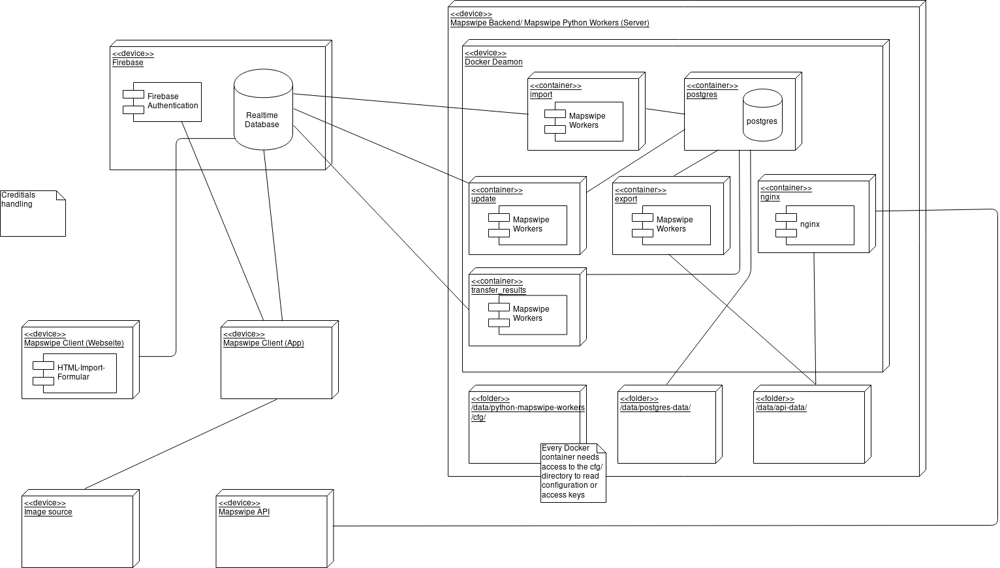

# Introduction

Mapswipe Workers is the backend of [Mapswipe](https://mapswipe.org/). This is one component out of four for running Mapswipe. 
The others components are the Mapwipe Website, including the project submit formula for creating new projects, the Mapswipe App (Android and ios) and a Firebase instance for communication between the App, the backend and the website. On how those components are connected please refer to the deployment diagram below.

GitHub repository of Mapswipe Wokers: https://github.com/mapswipe/python-mapswipe-workers
GitHub repository of the Mapwipe website: https://github.com/mapswipe/mapswipe.github.io
GitHub repository of the Mapswipe App https://github.com/mapswipe/mapswipe

For more information on Mapwipe please visit the Website and take a look at the OSM-Wiki page of Mapwipe: https://wiki.openstreetmap.org/wiki/MapSwipe

