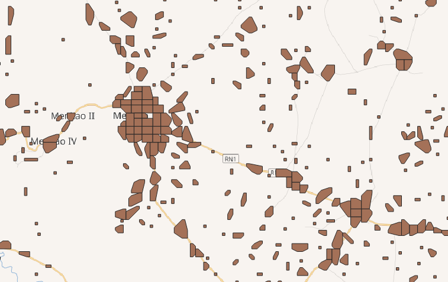

# Data
Swiping is just the beginning -- MapSwipe data is created by our users and accessible to the entire community. Through the [MapSwipe website](https://mapswipe.org/data.html) you can see where we've mapped, which organizations are requesting data, and how many individuals contribute to our impact. When using MapSwipe data, all you have to do is credit the MapSwipe contributors. Here you find a more detailed description of the data available.

## Projects

Files:
- [projects.csv](https://apps.mapswipe.org/api/projects/projects.csv)
- [projects_geom.geojson](https://apps.mapswipe.org/api/projects/projects_geom.geojson)
- [projects_centroid.geojson](https://apps.mapswipe.org/api/projects/projects_centroid.geojson)

Attributes:

| Name | Type | Description |
| ---- | ---- | ----------- |
| idx  | integer | - |
| project_id | string | The ID of the project used in Firebase. |
| name | string | The name of the project as displayed in the app. For newer projects this will be a composition of project topic, project region and project number. |
| project_details | string | The project description. This is displayed in the app on the project page. |
| look_for | string | What should the users look for (e.g. buildings, cars, trees)? |
| project_type | integer | The type of the project. 1=BuildArea, 2=Footprint, 3=ChangeDetection, 4=Completeness |
| tile_server_names | string | The names of the satellite imagery providers used for this project. Some projects, e.g. Change Detection Type projects, have multiple tile server names. |
| status | string | The status of the project defines if the project is visible in the app. There are the following values: active, inactive, finished, archived. Archived projects can not be set to active again. |
| area_sqkm | float | The size of the project area in square kilometers. |
| geom | string | The geometry of the project region as WKT geometry. |
| centroid | string | The centroid of the project geometry as WKT geometry. |
| progress | float | The mapping progress of the project. 1.0=completed. |
| number_of_users | integer | The number of distinct users who contributed to this project. |
| number_of_results | integer | The total number of results for all tasks. |
| number_of_results_progress | integer | The number of results that are taken into account for the progress calculation. If a tasks has been mapped more often than required, usually 3-times, the additional results are not considered for the progress calculation. |
| day | string | The date when the project information was updated the last time. |

## Aggregated Results
This gives you the unfiltered MapSwipe results. This is most suited if you want to apply some custom data processing with the MapSwipe data, e.g. select only specific tasks for machine learning. If you want to use MapSwipe data in the Tasking Manager you might look for the data described below.

Files:
- `aggregated_results_{project_id}.csv`, e.g. [agg\_results\_-M56eeMCZ5VeOHjJN4Bx.csv](https://apps.mapswipe.org/api/agg_results/agg_results_-M56eeMCZ5VeOHjJN4Bx.csv)
- `aggregated_results_{project_id}.geojson`, e.g. [agg\_results\_-M56eeMCZ5VeOHjJN4Bx.geojson](https://apps.mapswipe.org/api/agg_results/agg_results_-M56eeMCZ5VeOHjJN4Bx.geojson)

| Name | Type | Description |
| ---- | ---- | ----------- |
| idx  | integer | - |
| task_id | string | The ID of the task, for BuildArea projects this is a composition of `TileZ-TileX-TileY` |
| 0_count | integer | The number of users who marked this task as 0, e.g. "no building" for BuildArea Project Type. |
| 1_count | integer | The number of users who marked this task as 1, e.g. "building" for BuildArea Project Type. |
| 2_count | integer | The number of users who marked this task as 2, e.g. "maybe" for BuildArea Project Type. |
| 3_count | integer | The number of users who marked this task as 3, e.g. "bad imagery" for BuildArea Project Type. |
| total_count | integer | The total number of users who mapped this task. |
| 0_share | float | 0_count divived by total_count. This gives you the share of all users who marked as 0. |
| 1_share | float | 1_count divived by total_count. This gives you the share of all users who marked as 1. |
| 2_share | float | 2_count divived by total_count. This gives you the share of all users who marked as 2. |
| 3_share | float | 3_count divived by total_count. This gives you the share of all users who marked as 3. |
| agreement | float | This is defined as [Scott's Pi](https://en.wikipedia.org/wiki/Scott%27s_Pi) and gives you an understanding of inter-rater reliability. The value is 1.0 if all users agree, e.g. all users classify as "building". If users disagree this value will be lower. |
| geom | string | The geometry of this task as WKT geometry. |
 
Additionally, project type specific data can be found here. E.g. footprint projects which were created based on OSM data, will have data describing the original OSM object included.
 

## HOT Tasking Manager Geometries

This gives you filtered MapSwipe data ready to be imported to the HOT Tasking Manager. 
Currently, the geometries in this dataset consist of maximum 15 MapSwipe Tasks, where at least 35% of all users indicated the presence of a building by classifying as "yes" or "maybe". 
 
 Files:
 - `hot_tm_{project_id}.geojson`, e.g. [hot\_tm\_-M56eeMCZ5VeOHjJN4Bx.geojson](https://apps.mapswipe.org/api/hot_tm/hot_tm_-M56eeMCZ5VeOHjJN4Bx.geojson)
 
| Name | Type | Description |
| ---- | ---- | ----------- |
| group_id | integer | A ID for the geometry. It has no connection to the MapSwipe data model. |
| geometry | geometry | A polygon geometry representing the selected MapSwipe tasks. In our GIS workflow we further aggregate and simplify the geometry, hence they kind of look like easter eggs. |

 
## Users

This gives you data on the users which contributed to a project.

| Name                      | Type    | Description                                                                                                                                                      |
|---------------------------|---------|------------------------------------------------------------------------------------------------------------------------------------------------------------------|
| idx                       | integer | -                                                                                                                                                                |
| groups_completed          | integer | Number of groups completed                                                                                                                                       |
| total_contributions       | integer | Number of tasks completed                                                                                                                                        |
| agreeing_contributions    | integer | Tasks with the same result as the final result (e.g. Tile has buildings).                                                                                        |
| disagreeing_contributions | integer | Tasks with other result as the final result.                                                                                                                     |
| simple_agreement_score    | float   | Share of tasks which had the same result as the final result. E.g. 0.8 would mean that the user labeled 80% of the tiles the same way as the majority of voters. |
