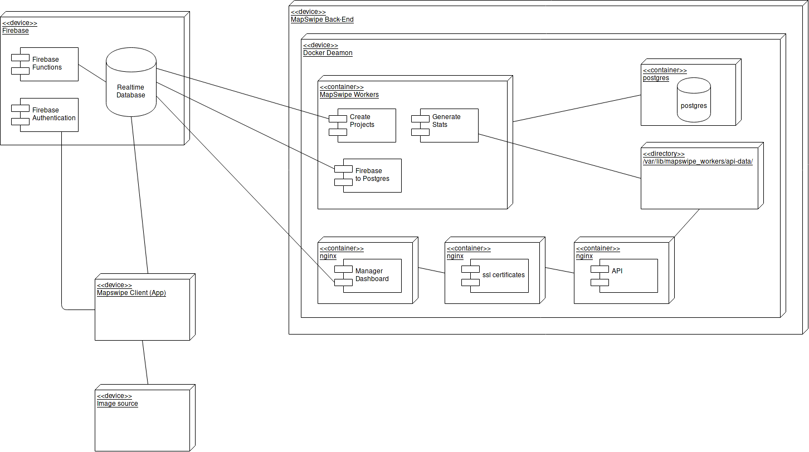
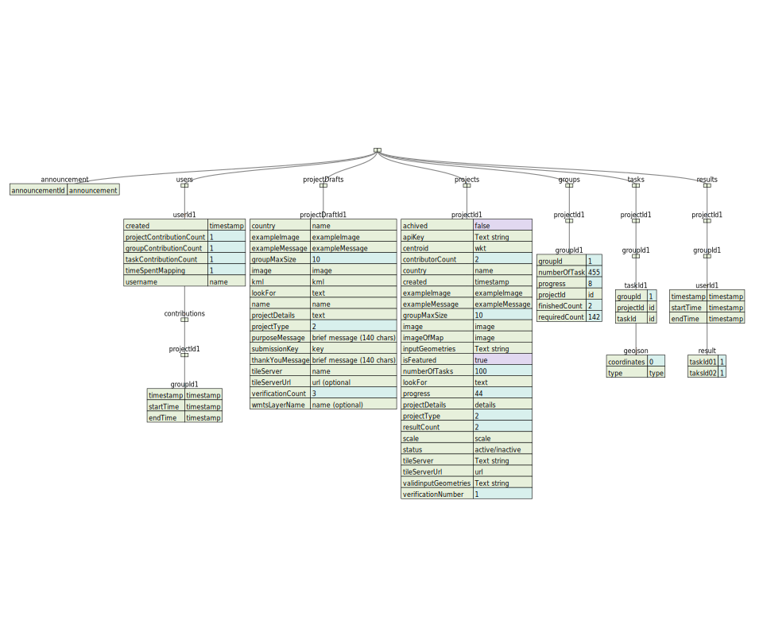
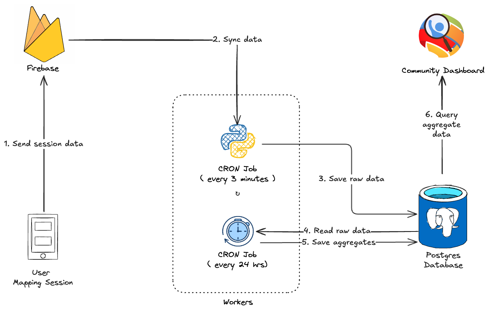

# Diagrams

This document collects all diagrams associated with Mapswipe.

In the next MapSwipe version release (MapSwipe for Compare Analysis) those diagrams should be showing only the currently implemented structure and integrated with the docs in the appropriate places.

The Diagrams are drawn using [draw.io](https://.wwww.draw.io). You can download the `diagram.xml` file in the GitHub repository (docs/\_static/img/) and upload it to draw.io if you want to edit it. The JSON based data structure diagrams of the Firebase Realtime Database are drwan using sample_data.json, which also can be found in the GitHub repository (docs/\_static/img/) files and this tool: https://vanya.jp.net/vtree/

---

**Deployment Diagram:**

---

**Proposed Data Structure Project Type 1 - Firebase:**

---

**Proposed Data Structure Project Type 2 - Firebase:**

---

**Database Scheme - Postgres:**

---

**Entity Relationship Diagram - Postgres:**

---

**Database Schema - Analytics:**

---

**Mapping Sessions - Time Calculation**

The diagram below is a visual representation of how time is calculated in MapSwipe. 

Step 1: User Mapping Session **sends data** to Firebase
- When a user completes a mapping session in the mobile/web app, the session payload (including start/end timestamps, user ID, session metadata, etc.) is sent in real time to Firebase.

Step 2: Cron job **fetches data** from the firebase 
- Every 3 minutes, a cron job syncs data for any new session records and pulls them into the backend.

Step 3: Cron job **saves raw data** to Postgres database
- The cron job sends new session data to the Postgres database.

Step 4: Cron job **reads raw data** from Postgres database
- Another cron job reads the raw data from Postgres database.

Step 5: Cron job **saves aggregates** to Postgres database
- The cron job aggregates previous 24 hours data (end date - start date), sends back, and saves processed aggregated data to the Postgres database.

Step 6: Community dashboard **queries aggregate data** from Postgres database 
- The Community dashboard pulls the processed data from the Postgres database and updates the dashbaord with up-to-date stats.

