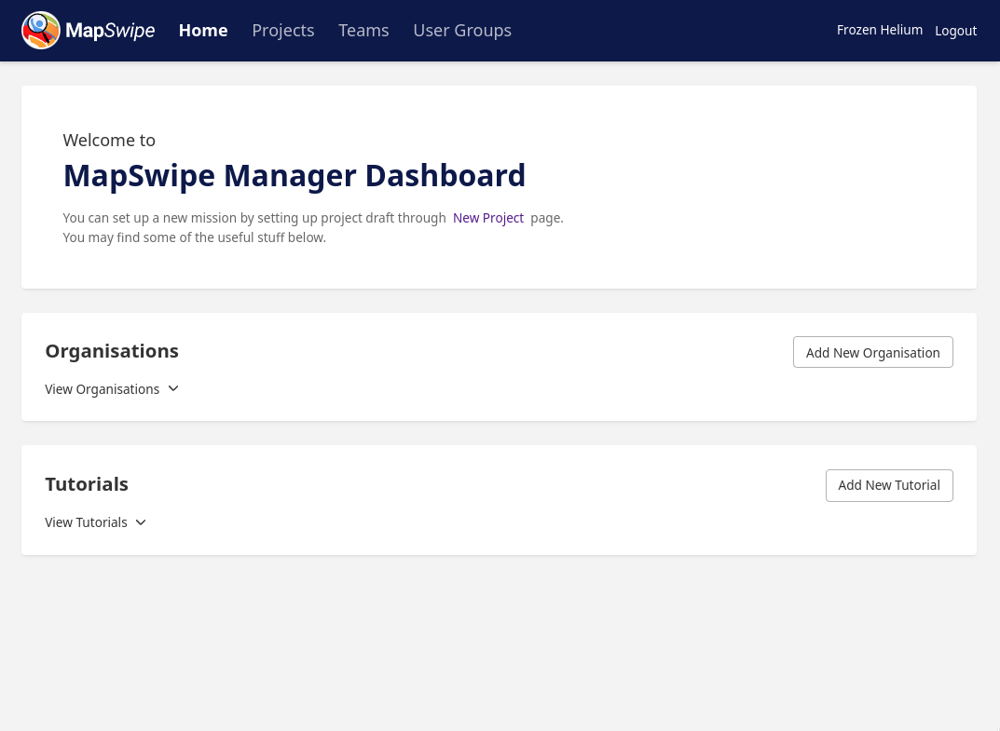
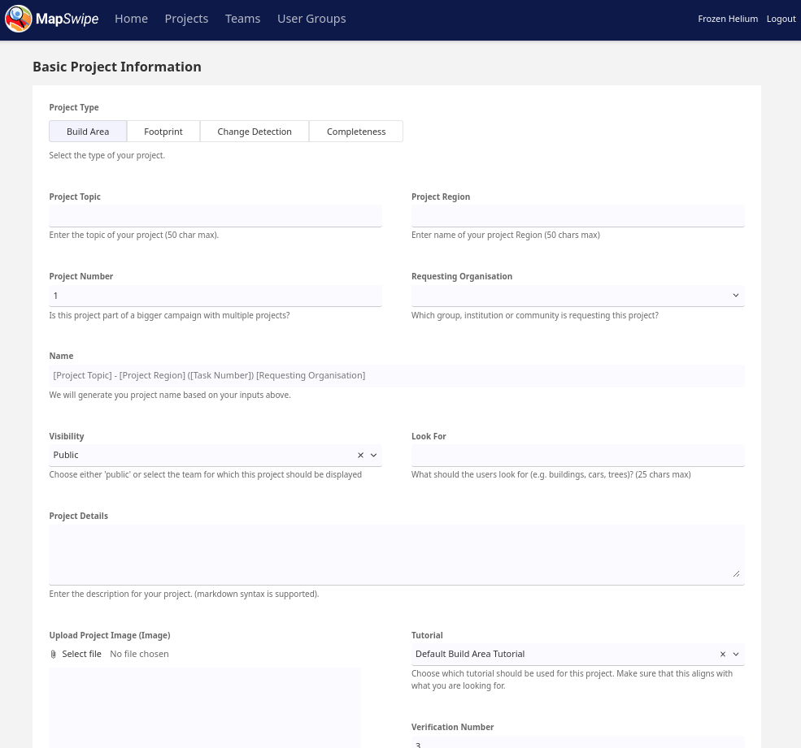
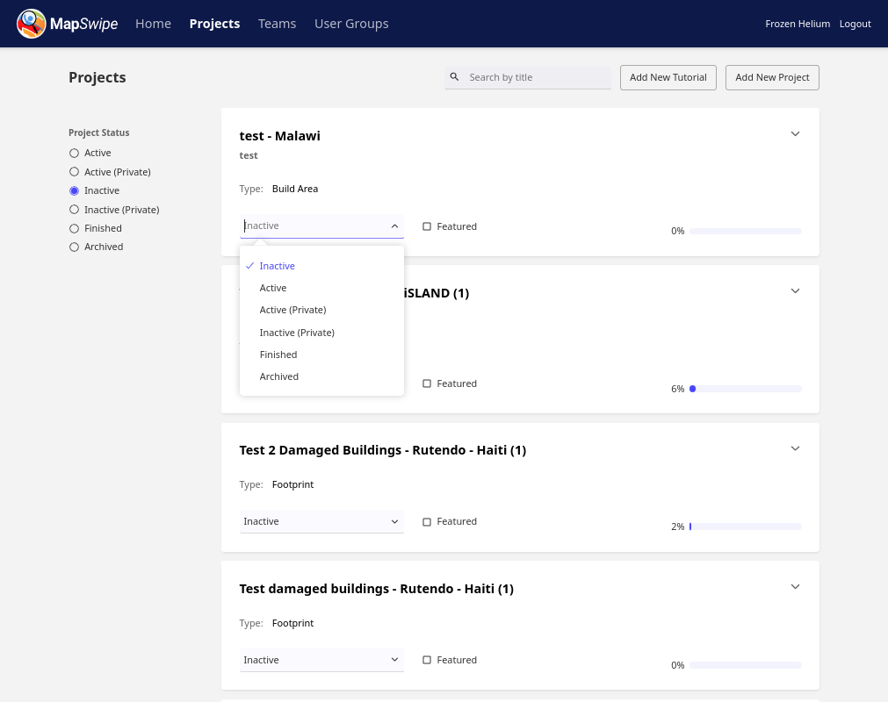

# For MapSwipe Managers

## Setting up a new MapSwipe mission 
Any of the Missing Maps members can request a MapSwipe mission. If you want to add a new mission, but don't know how to do it, it will be best to reach out to the MapSwipe community via Slack.

To set up a new mission you can create a project draft through the [Manager Dashboard](https://dev.mapswipe.org/manager_dashboard/). Sign in with your MapSwipe account. In order to create new projects you need dedicated *project manager credentials*. Reach out to the MapSwipe community if you don't have these already. Once you're signed in, you will see a screen similar to the one below.



You can directly go to create **New Project** page from here, or you can navigate to the **Projects** page from the navbar at the top and then click on **Add New Project** button on the top right. You'll be navigate to the New Project Page which will look like following.



General points of attention: 
* Verify if the project name is short and clear
* The minimum verification count is 3. The algorithm is calculated on that. Less persons looking at one square has implications on the quality of the MapSwipe data. The best results we have with a 5 person verification.
* Reread, correct and improve the description given through the request.
* Check if the image is the good format and if the size is not to big - max 1MB. The image will be show as a thumbnail for your mission.
* Tile server import, which imagery are you using is the question here. We only have legal permission to use Bing for now. For custom tile servers (e.g. from OpenAerial Map) check the permission.
* Check the (Bing) imagery available for the area, we learned that good imagery is key to keep a mission going. If the imagery is not good enough or covered by clouds adjust the area. You need to zoom in till level 18. 

For BuildArea and ChangeDetection projects:
* MapSwipe can only process geographical areas up to 5,000km<sup>2</sup>. Check if the GeoJSON you received has this size. If not, you may need to split up the area into multiple pieces, and create more than one MapSwipe mission out of the area.
* The GeoJSON needs to be a flat polygon, check this and change (in [geojson.io](https://geojson.io) or QGIS) if needed.

For Footprint projects:
* The GeoJSON file should contain only simple Polygons. We currently don't support complex Multipolygon geometries (e.g. [polygon with holes](https://developers.google.com/maps/documentation/javascript/examples/polygon-hole)) 

Once you submit, the task should appear relatively quickly in the manager dashboard. You will receive a message in Slack. 
But it's still not active and not visible to the MapSwipe app users. 
You need to set the project status to `active` through the manager dashboard. Just navigate to the **Projects** page and then change the Project Status on the left filter pane to show **Inactive** projects. You'll find the project you've just created here. Now, you can set the project status to be **Active** from the dropdown as shown in the screenshot below.
If the new project does not appear in the app after about 1 hour, check Slack for an error message, and see Troubleshooting section below.


 
## Troubleshooting
* If a project does not show up in the app or on the project dashboard, probably something went wrong with the GeoJSON file, visit the imports dashboard - hopefully it will be the last in the list and the error can be determined and fixed. Please ask on the MapSwipe slack if you cannot determine the error.
* If the project is not in the imports dashboard, then it was not successfully submitted and you may try again.
* If you encounter any error like *the % is not rising anymore in the app*, *the number of mappers is not rising anymore in the app* *firebase functions* might be the reason for this. Check firebase functions logs (Firebase > Functions > Logs) or reach out for help in Slack.


## Becoming a project manager

If you have access to the mapswipe backend server you can grant project manager rights like this:

```bash
docker run --name mapswipe_workers_local -it pythonmapswipeworkers_mapswipe_workers  bash`
mapswipe_workers --verbose user-management --email=your_email@xyz.org --manager=true
exit
docker rm mapswipe_workers_local
```
