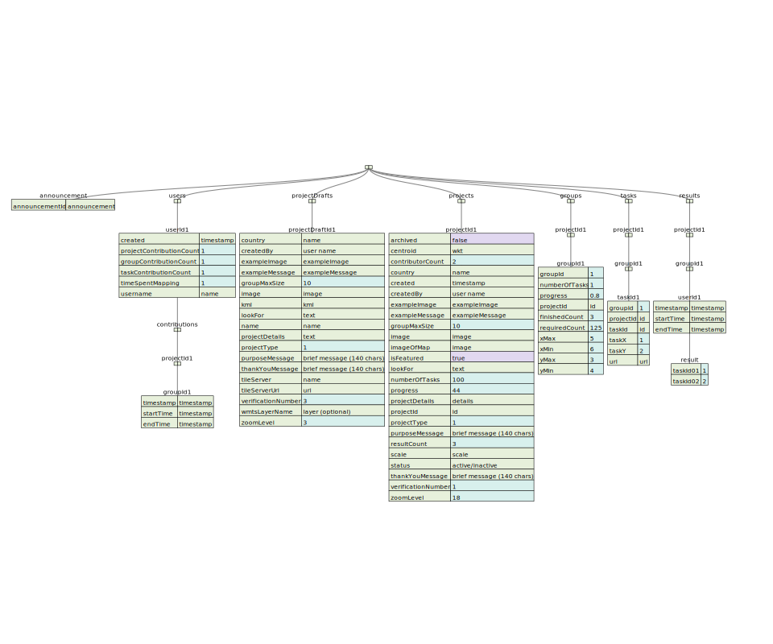

# Build Area



### Project Drafts

To initialize a Build Area Project as a Project Manager you only need to upload a bounding polygon as well as fill in some information about your mission.
Details on the basic information you need to fill in to describe you mission can be found on the [main project type site](project_type.html).

```json
{
  "createdBy": "TestCreator",
  "geometry": {
    "type": "FeatureCollection",
    "features": [{
      "type": "Feature",
      "geometry": {
        "type": "Polygon",
        "coordinates": [
          [
            [34.975833892822266, -15.899098066386088],
            [35.089302062988274, -15.899098066386088],
            [35.089302062988274, -15.820002241903946],
            [34.975833892822266, -15.820002241903946],
            [34.975833892822266, -15.899098066386088]
          ]
        ]
      },
      "properties": {}
    }]
  },
  "image": "",
  "lookFor": "buildings",
  "name": "test - Malawi (1)\ntest",
  "projectDetails": "This is a test project",
  "verificationNumber": 3,
  "groupSize": 120,
  "tileServer": {
    "name": "bing",
    "credits": "© 2019 Microsoft Corporation, Earthstar Geographics SIO"
  },
  "projectType": 1
}
```

### Projects
Below you can find an example for a created Build Area project in firebase.

```json
{
	"contributorCount": 1,
	"created": "2021-12-23T13:47:27.346088Z",
	"createdBy": "X0zTSyvY0khDfRwc99aQfIjTEPK2",
	"groupMaxSize": 0,
	"groupSize": 25,
	"image": "https://firebasestorage.googleapis.com/v0/b/dev-mapswipe.appspot.com/o/projectImages%2Fbuildarea.png?alt=media&token=07505c0e-0f80-454c-b446-9b82a73d9d3e",
	"isFeatured": false,
	"lookFor": "Buildings",
	"name": "Build Area with Bing Imagery Z18 - Kenya (1)\nMapSwipe Devs",
	"progress": 0,
	"projectDetails": "This is a \"normal\" Build Area project. The project uses Bing Imagery at zoom level 18",
	"projectId": "-MrbXgHx8YJDt6cTIyGA",
	"projectNumber": "1",
	"projectRegion": "Kenya",
	"projectTopic": "Build Area with Bing Imagery Z18",
	"projectType": 1,
	"requestingOrganisation": "MapSwipe Devs",
	"requiredResults": 148158,
	"resultCount": 0,
	"status": "active",
	"tileServer": {
		"apiKey": "AopsdXjtTu-IwNoCTiZBtgRJ1g7yPkzAi65nXplc-eLJwZHYlAIf2yuSY_Kjg3Wn",
		"credits": "imagery credits of project",
		"name": "bing",
		"url": "https://ecn.t0.tiles.virtualearth.net/tiles/a{quad_key}.jpeg?g=1&token={key}"
	},
	"tutorialId": "tutorial_-MnNaUEShyefFtMG6_5-",
	"verificationNumber": 3,
	"zoomLevel": 18
}
```
### Tasks

| Parameter                           | Description                                                                                                                                                                                                                                                                                                                                                                            |
|-------------------------------------|----------------------------------------------------------------------------------------------------------------------------------------------------------------------------------------------------------------------------------------------------------------------------------------------------------------------------------------------------------------------------------------|
| *Project Type Specific Information* |                                                                                                                                                                                                                                                                                                                                                                                        |
| **Tile Z**                          | The z coordinate of the tile defines the zoom level. Greater values for z will correspond to higher spatial resolution of the corresponding image. For most regions Bing provides images up to zoom level 18. For aerial imagery or images captured by UAVs even higher z values are valid.                                                                                            |
| **Tile X**                          | The x coordinate characterises the longitudinal position of the tile in the overall tile map system taken the zoom level into account. The x coordinates increase from west to east starting at a longitude of -180 degrees.                                                                                                                                                           |
| **Tile Y**                          | The y coordinate characterises the latitudinal position of the tile in the overall tile map system taken the zoom level into account. The latitude is clipped to range from circa -85 to 85 degrees. The y coordinates increase from north to south starting at a latitude of around 85 degrees.                                                                                       |
| **Geometry**                        | Each task has a polygon geometry, which can be generated by its x, y and z coordinates. At the equator the task geometry is a square with an edge length of around 150 metres covering circa 0.0225 square kilometres. Due to the web Mercator projector the task geometry will be clinched with increasing distance to the equator. At the same time the area per task will decrease. |
| **Tile URL**                        | The tile URL points to the specific tile image described by the x, y, and z coordinates. Usually, the image has a resolution of 256 x 256 pixels. However, some providers also generate image tiles with higher resolution (e.g. 512 x 512 pixels).                                                                                                                                    |

### Groups

The grouping algorithm uses the extent of a project as an input and generates chunks of tasks lying next to each other. 
Each group has a height of three tasks and a width of approximately 40 tasks.

| Parameter    | Description                                                                                          |
|--------------|------------------------------------------------------------------------------------------------------|
| **Geometry** | The Build Area groups save the bounding box coordinates in fields labeled xMax, xMin, yMax and yMin. |

### Results

Results contain information on the user classifications. However, only “Yes” (1), “Maybe” (2) and “Bad Imagery” (3) classifications are stored as results. 
Whenever users indicate “No building” by just swiping to the next set of tasks, no data entry is created.
“No Building” classifications can only be modelled retrospectively for groups where a user also submitted at least one “Yes”, “Maybe” or “Bad Imagery” classification.