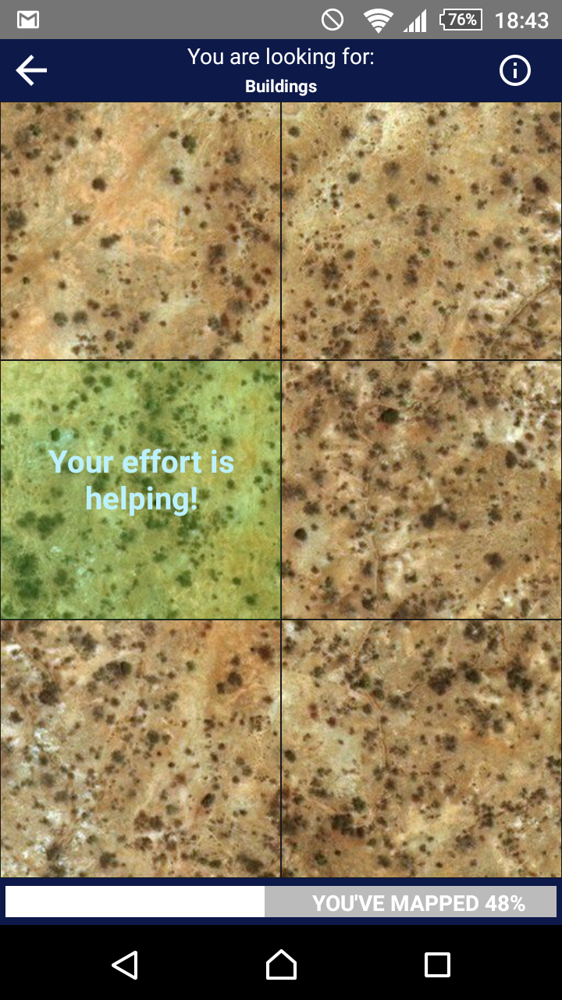
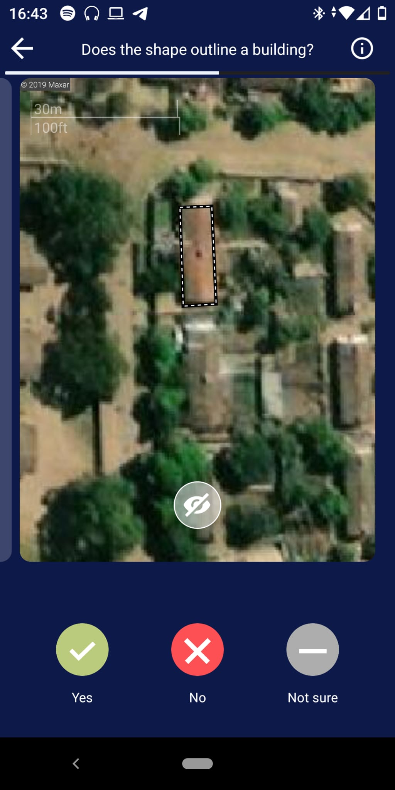
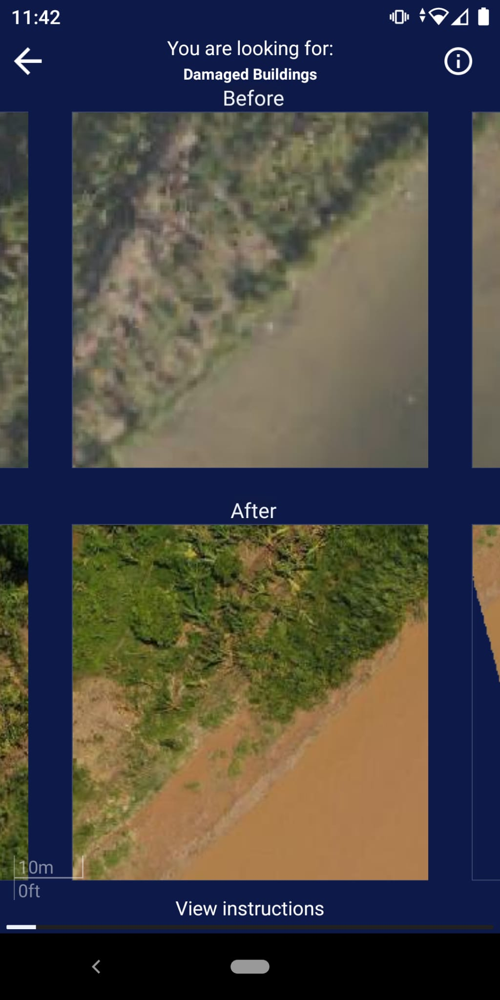
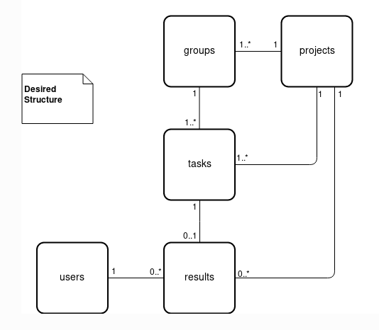

# Project Types and Data Model
## MapSwipe's Crowdsourcing Approach
The MapSwipe crowdsourcing workflow is designed following an approach already presented by [Albuquerque et al. (2016)](http://www.mdpi.com/2072-4292/8/10/859). The main ideas about MapSwipe's crowdsourcing approach (and many other crowdsourcing tasks) lies in
1. **Defining** the mapping challenge by posing a simple question (e.g. "Which areas are inhabited in South Kivu?")
2. **Dividing** the overall challenge into many smaller manageable components (e.g. *groups* and *tasks* based on satellite imagery tiles)
3. **Distributing** *groups* and *tasks* to many users redundantly (e.g. every area gets mapped by at least three different users)
4. **Aggregating** all responses (*results*) per *task* from different users  to reach a final solution (e.g. by choosing the majority vote)

The MapSwipe back end currently supports 3 **project types**. Each project type formulates a specific kind of mapping challenge.

| Name | ID | Description | Screenshot |
| ---- | -- | ----------- | ---------- |
| [BuildArea](project_type-buildArea.html) | 1 | A 6 squares layout is used for this project type. By tapping you can classify a tile of satellite imagery as *yes*, *maybe* or *bad_imagery*. Project managers can define which objects to look for, e.g. "buildings". Furthermore, they can specify the tile server of the background satellite imagery, e.g. "bing" or a custom tile server. |  |
| [Footprint](project_type-footprint.html) | 2 | An image with a footprint overlay. The question is whether this footprint is correctly approximating a structure on the shown image, which can be answered with *yes*, *no* or *Not sure*. Additionally, a button is shown which hides the footprint overlay. |  |
| [ChangeDetection](project_type-changeDetection.html) | 3 | Two images are shown, the upper picture shows a scene before e.g. a disaster, while the lower picture shows the scene afterwards. By tapping you can classify the scene as *yes*, *maybe* or *bad_imagery*. Project managers can define which objects to look for, e.g. "buildings". Furthermore, they can specify the tile server of the background satellite imagery, e.g. "bing" or a custom tile server. |  |

## Data Model
This way of formulating the overall crowdsourcing challenge and it's subcomponents shapes the **data model** we use. 
The data model is depicted in *Figure 1* and consists of the following parts:

* project drafts
* projects
* groups
* tasks
* results
* users
* announcement (can be set manually in firebase -> banner at the top of the app)

|  |

Below you can see the structure on the example of a Build Area project. The project manager supplies a bounding polygon, 
which is then divided into multiple groups, which are in turn divided into multiple tasks. 
Results are always bound to a task and what a result means differs by project type.

| 

As a project manager you have to care about the **Project Drafts** only. The information you provide through the **Manager Dashboard** will be used to set up your project. You should provide the following information.

### Project Drafts
The project drafts contain all information needed to set up your project. 
Only MapSwipe user accounts with dedicated **project manager role** can create projects. 
Make sure to get the rights before submitting project drafts.

After project managers defined their mapping challenges in the very first step, they can generate **project drafts** through the manager dashboard. 
The project drafts contain all information about your mapping challenge that you need to initialize a project in MapSwipe. 
For instance, the project draft defines which area you want to get mapped and how many users should work on each task.

| Parameter                           | Description                                                                                                                                                                       |
|-------------------------------------|-----------------------------------------------------------------------------------------------------------------------------------------------------------------------------------|
| _Basic Information_                 | These parameters are the same across all project types.                                                                                                                           |
| **Name**                            | The name of your project (25 chars max)                                                                                                                                           |
| **Look For**                        | What should the users look for (e.g. buildings, cars, trees)? (15 chars max).                                                                                                     |
| **Project Type**                    | The type of your mapping challenge.                                                                                                                                               |
| **Direct Image Link**               | An url to an image. Make sure you have the rights to use this image. It should end with .jpg or .png.                                                                             |
| **Project Details**                 | The description for your project. (3-5 sentences).                                                                                                                                |
| **Verification Number**             | How many people do you want to see every tile before you consider it finished? (default is 3 - more is recommended for harder tasks, but this will also make project take longer) |
| **Group Size**                      | How big should a mapping session be? Group size refers to the number of tasks per mapping session.                                                                                |
| _Project Type Specific Information_ | There will be varying parameters defined by the individual project types. You can find this information at the page for each project type.                                        |

### Projects
The **project** holds all information provided by the project drafts, 
but adds additional information which are needed for the MapSwipe app such as progress and number of users who contributed. 
A project consists of several groups.

| Parameter                           | Description                                                                                                                                         |
|-------------------------------------|-----------------------------------------------------------------------------------------------------------------------------------------------------|
| *Basic Information*                 |                                                                                                                                                     |
| **Name**                            | The name of your project (25 chars max)                                                                                                             |
| **Look For**                        | What should the users look for (e.g. buildings, cars, trees)? (15 chars max).                                                                       |
| **Project Type**                    | Is `1` for all Build Area projects.                                                                                                                 |
| **Direct Image Link**               | An url to an image. Make sure you have the rights to use this image. It should end with .jpg or .png.                                               |
| **Project Details**                 | The description for your project. (3-5 sentences).                                                                                                  |
| **Verification Number**             | How many people do you want to see every tile before you consider it finished? (default is 3 - more is recommended for harder tasks, but this will also make project take longer) |
| **Group Size**                      | How big should a mapping session be? Group size refers to the number of tasks per mapping session.                                                  |
| **progress**                        |                                                                                                                                                     |
| **isFeatured**                      | If true the project will appear bigger in the app.                                                                                                  |
| **projectId**                       | ID of the project.                                                                                                                                  |
| **contributorCount**                | How many volunteers contributed.                                                                                                                    |
| **resultCount**                     |                                                                                                                                                     |
| **numberOfTasks**                   | Number of tasks in project.                                                                                                                         |
| **status**                          | Active vs inactive.                                                                                                                                 |
| *Project Type Specific Information* | There will be varying parameters defined by the individual project types. You can find this information at the page for each project type.          |

### Groups
The **groups** are an intermediary between projects and tasks. 
Each group belongs to a single project and consists of several tasks. 

Single MapSwipe projects can contain up to several hundred thousand tasks. 
This can pose a challenge to fast and performant communication between clients and server if many volunteers contribute data at the same time. 
Therefore, groups have been introduced to reduce the amount of client requests on the backend server. 

Groups consists of several tasks, that will be shown to the user in one mapping session.
They are the key to distribute tasks to MapSwipe users in a way that we can ensure that everything gets mapped as often as required in an efficient manner.

| Parameter                           | Description                                                                                                                                                                                                                                                                                                                                                                                                                                                       |
|-------------------------------------|-------------------------------------------------------------------------------------------------------------------------------------------------------------------------------------------------------------------------------------------------------------------------------------------------------------------------------------------------------------------------------------------------------------------------------------------------------------------|
| *Basic Information*                 |                                                                                                                                                                                                                                                                                                                                                                                                                                                                   |
| groupId                             | ID of the group.                                                                                                                                                                                                                                                                                                                                                                                                                                                  |
| numberOfTasks                       | How many tasks are in each group.                                                                                                                                                                                                                                                                                                                                                                                                                                 |
| projectId                           | ID of the project the group belongs to.                                                                                                                                                                                                                                                                                                                                                                                                                           |
| finishedCount                       | Once a group has been completely mapped by a volunteer the completed count of the corresponding group will be raised by one. The completed count of the group is used to assess the overall progress of each project.  For doing so the completed count is compared to the redundancy required (see Table 2). During the mapping process groups will be served in ascending completed count order. Thus, groups with low completed count will be served first |
| requiredCount                       | How many volunteers have to map a group.                                                                                                                                                                                                                                                                                                                                                                                                                          |
| *Project Type Specific Information* | There will be varying parameters defined by the individual project types. You can find this information at the page for each project type.                                                                                                                                                                                                                                                                                                                        |

### Tasks
The **tasks** are the smallest component in our data model. 
Each task formulates an easy and quick to solve mapping challenge. 
In many cases this challenge can be put into a simple question, e.g. *Can you see a building in this satellite imagery tile*. 
Tasks always belong to a specific group and project.

Tasks are usually gzip compressed on firebase to save space. That is why this information is not readable by humans in firebase.

| Parameter                           | Description                                                                                                                                |
|-------------------------------------|--------------------------------------------------------------------------------------------------------------------------------------------|
| *Basic Information*                 |                                                                                                                                            |
| **taskId**                          | ID of the task.                                                                                                                            |
| **groupId**                         | ID of the group the task belongs to.                                                                                                       |
| **projectId**                       | ID of the project the task belongs to.                                                                                                     |
| *Project Type Specific Information* | There will be varying parameters defined by the individual project types. You can find this information at the page for each project type. |

### Results
The **results** hold the information you wanted in the very beginning. 
For each task you will receive several results by different users. 
A result is the simple answer to your initial question. 
For instance, it's a simple "yes" to the question "can you see a building in this satellite imagery tile".

| Parameter | Description |
|-----------|-------------|
| timestamp |             |
| startTime |             |
| endTime   |             |
| result    |             |

### Users
The **users** provide the results to your tasks. 
They are the key to solve your mapping challenge. 
For each user we generate mapping related statistics, e.g. the number of projects a user has been worked on.

| Parameter                 | Description |
|---------------------------|-------------|
| created                   |             |
| projectContributionsCount |             |
| groupContributionCount    |             |
| taskContributionCount     |             |
| timeSpentMapping          |             |
| username                  |             |
