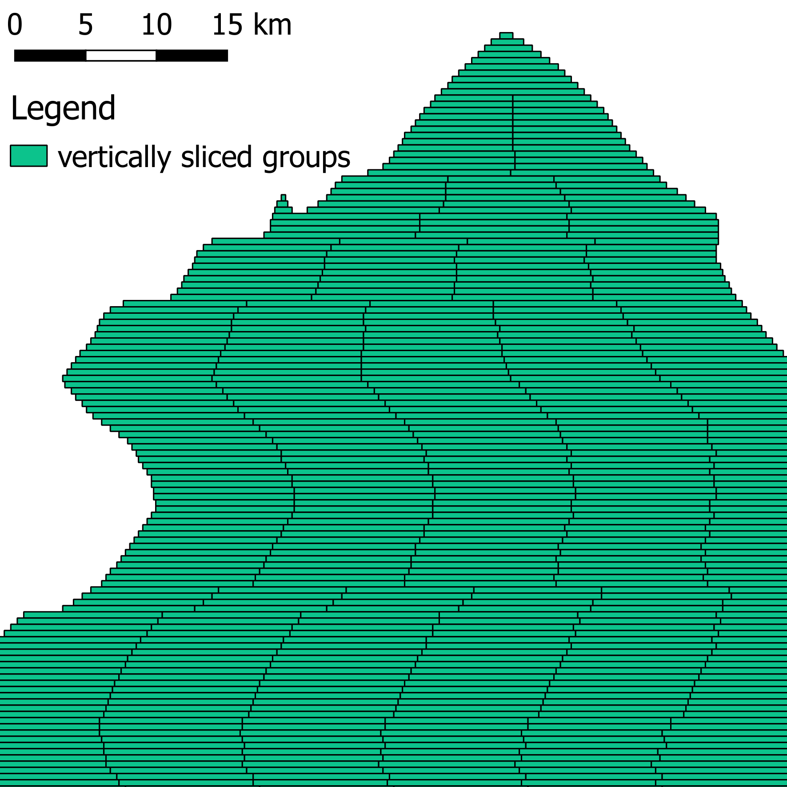

# Import Module Documentation
The import module uses data uploaded to the firebase imports table and creates the respective project information and information regarding groups and tasks. When importing projects we set the project ids as non sequential. We do this to avoid that the data is rendered as an array. More on this issuegot can be found [here](https://www.firebase.com/docs/ios/guide/understanding-data.html#section-arrays-in-firebase).

The import module gets data from firebase and creates the following tables/files:
* `data/project_{id}.kml`: the geometry of the project as provided in the import
* `data/groups_{}.json`: the groups, containing information on tasks, that are uploaded to firebase
* `data/groups_{id}.geojson`: the groups, without further task information, and geometry and extent for each group
* insert a column for each new project in mysql `projects` table

## Authentification Configuration and Requirements
To properly run the update process you need the following credentials:
* access to firebase
* access to mapswipe mysql database

The default configuration is stored in [auth.py](../cfg/auth.py). You can adapt to your own settings by providing a `config.cfg` file in the same folder as the auth.py script. You can use the [template](../cfg/your_config_file.cfg) for this.

## How to run import
You can run the complete import script like this:
* `python run_import.py`
* `python run_import.py -mo development`
* `python run_import.py -mo production`

Parameters:
* `-mo` or `--modus`: chose which mapswipe instance to use. Options: `development` (default), `production`
* `-l` or `--loop`: if this option is set, the import will be looped
* `-m` or `--max_iterations`: the maximum number of imports that should be performed in integer
* `-s` or `--sleep_time`: the time in seconds for which the script will pause in beetween two imports

PM2 Process Manager settings:
* we can use pm2 process manager to loop the script
* a pm2 configuration is provided in `loop_import_module.json`
* currently we start the update process every 900 seconds (15 minutes)
* you can monitor the process on the server like this:
```
sudo su
pm2 list
tail -100 /data/python-mapswipe-workers/export_module/export_data.log
```

The logs should look like this:
```
05-25 12:11:29 WARNING There are no projects to import.
```

## About the Grouping Algorithm
If the terms *group*, *task* and *project* sound not familiar to you in the context of MapSwipe have a look at the [MapSwipe data model](../mapswipe_data_model.md) first.

The grouping algorithm creates a `.json` file that can be uploaded into firebase groups table. This file contains also the task information for all tasks within each group. There is no separate file for tasks. All information is stored in the `group_{project_id}.json` file. Basically the grouping workflow contains of these steps:
* load geometry from `.kml`, `.geojson` or `.shp` file (`get_geometry_from_file(input_file)`)
* slice input polygon horizontally (`get_horizontal_slice(extent, geomcol, config['zoom'])`)
    * All created slices will have a height of three tiles
* slice horizontal slices again, but now vertically (`get_vertical_slice(horizontal_slice, config['zoom'])`)
    * The `width_threshold` parameter specified in the script defines how *long* the groups will be. Currently we use a width of 70 tiles.
* create tasks for each group polygon and add to the group dictionary (`create_tasks(xmin, xmax, ymin, ymax, config)`)

  

### How to run
You can run the `create_groups` script like this:
* `python create_groups.py -i=data/project_13505.kml -t=bing -z=18 -p=13505`

Parameters:
* `-i` or `--input_file`: the input file containning the geometry as kml, shp or geojson
* `-t` or `--tileserver`: choose ['bing' (default), 'digital_globe', 'google', 'sinergise', 'custom']
* `-z` or `--zoomlevel`: defines the resolution and number of tasks, default(18)
* `-p` or `--project_id`: the id of the respective project
* `-c` or `--custom_tileserver_url`: provide a custom url, if you defined `custom` as tilevserver. Make sure that this url containers `{z}`, `{x}`, `{y}` placeholders.
* `-l` or `--wmts_layer_name`: the name of the wmts layer.


